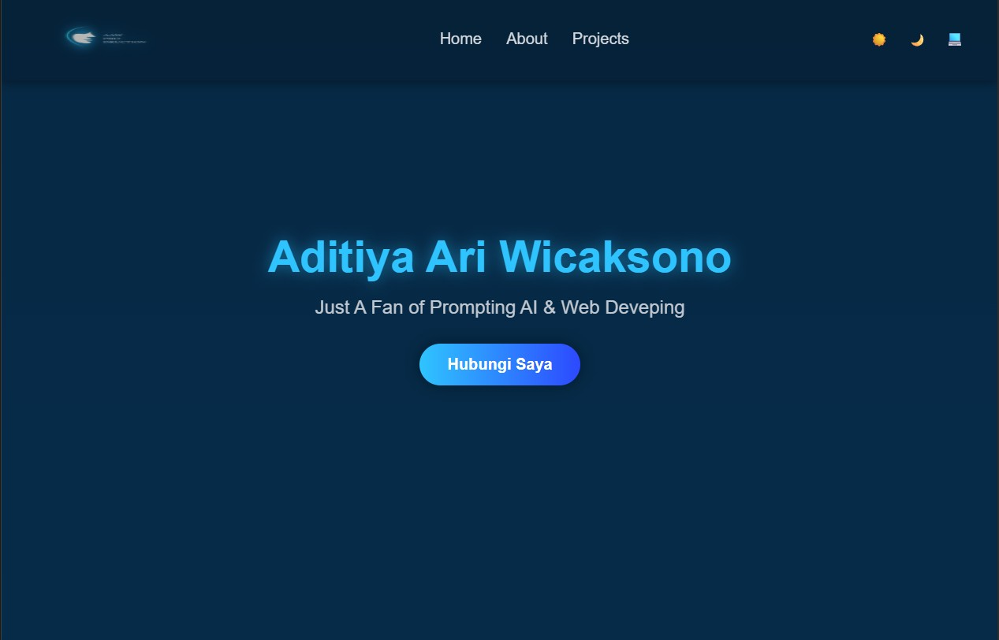

# 🚀 Portofolio Pribadi - Aditiya Ari Wicaksono

> Pembuatannya Simple.  
> Menggunakan Prompt dari IBM dengan 2 jam waktu pengerjaan.

---
## 📸 Preview

| Teknologi | Description |
|----------|-------------|
| 🌐 **HTML5 & CSS3** | Fondasi struktur dan gaya untuk web modern |
| 🟨 **JavaScript (ES6+)** | Memberikan interaktivitas dan logika dinamis pada sisi klien |
| 🤖 **IBM Granite** | AI generatif yang digunakan sebagai asisten coding untuk pembuatan & optimisasi kode |
| 🎨 **Font Awesome** | Pustaka ikon untuk memperkaya visualisasi keahlian |
| 🚀 **GitHub Pages** | Platform hosting situs statis gratis yang terintegrasi dengan GitHub |

## 🤖 AI Support Explanation

| Area       | AI Capability | Description |
|------------|---------------|-------------|
| 🏛️ ** Struktur HTML	** | Pembuatan Kerangka Modular | Menghasilkan struktur HTML semantik untuk setiap bagian (Navbar, Hero, About, Projects, Skills) secara terpisah, memastikan fondasi yang kokoh. |
| 🎨 **  Styling CSS	** | Pembuatan Kerangka Modular | Generasi Variabel & Layout	Membuat variabel warna CSS untuk sistem tema dan menghasilkan kode Flexbox untuk layout dua kolom pada bagian "About Me" serta layout grid pada bagian "Projects" |
| 🏛️ ** Struktur HTML	** | Pembuatan Kerangka Modular | Menghasilkan struktur HTML semantik untuk setiap bagian (Navbar, Hero, About, Projects, Skills) secara terpisah, memastikan fondasi yang kokoh. |
| 📝 **Pembuatan Konten** | Penulisan Draf Teks | Membantu menyusun draf awal untuk teks "About Me" dengan gaya profesional yang sesuai dengan profil seorang AI Engineer. |
| ⚡ **Logika JavaScript** | 	Penulisan Fungsi Interaktif | Menghasilkan seluruh logika JavaScript untuk fitur pengalih tema (Dark/Light/System Mode), termasuk deteksi preferensi sistem dan penyimpanan pilihan di localStorage. |
| 🔧 **Code Optimization** | Performance & Readability | Mengoptimalkan kode hasil AI agar lebih efisien, mudah dibaca, dan terjaga maintainability-nya. |
| 🛠 **Troubleshooting** | AI-Driven Debugging | Mengidentifikasi masalah umum pada kode hasil AI dan memberikan solusi perbaikan secara langsung. |
| 📋 **Structured Review** | AI in Code Review | Menerapkan alur kerja terstruktur untuk meninjau dan memperbaiki kode menggunakan insight dari AI. |
| 🖥 **Hands-On Use** | Code Generation & Optimization | Menggunakan IBM Granite untuk membuat, mengoptimalkan, dan memecahkan masalah kode secara mandiri. |

